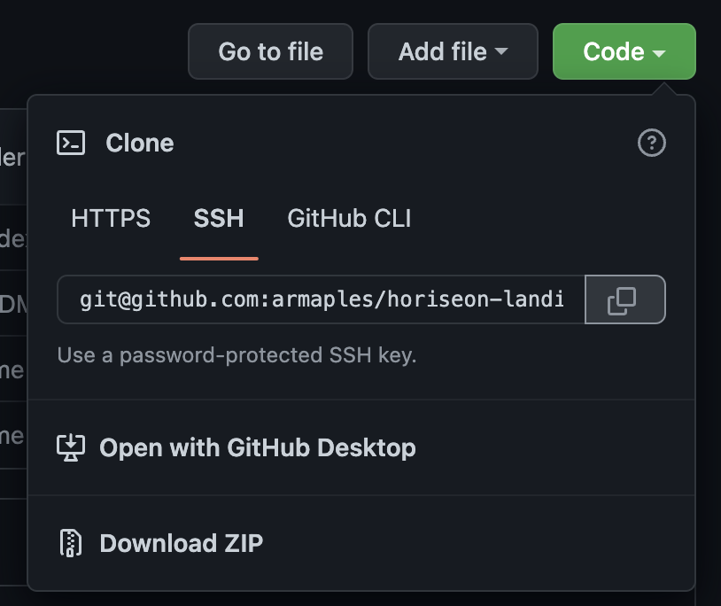
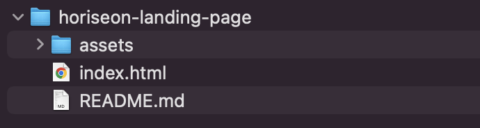
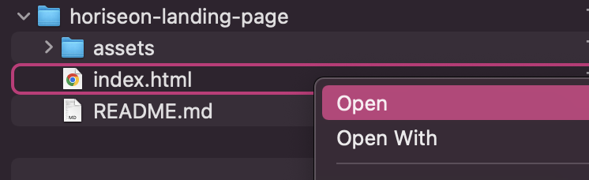

# Horiseon Landing Page

## Description

This project was meant to refactor an existing webpage for Horiseon Social Solution Services. The motivation for this project was to create a more accessible webpage, not only for the user but for the developer as well. Content on the page has been made accessible for users with screenreaders. Both the HTML and CSS files have been consolidated and made more readable and convenient for any future developers that work on the page. This project helped to showcase the importance of providing accessible and approachable webpages to help avoid common issues in the long-run.

## Table of Contents

- [Installation](#installation)
- [Code Examples](#code-examples)
    - [Consolidating CSS](#consolidating-css)
    - [Renaming HTML Elements](#renaming-html-elements)
- [Languages Used](#languages-used)
- [Important Links](#important-links)
- [Credits](#credits)
- [License](#license)
    - [MIT License](#mit-license)

## Installation

- Navigate to the 'clone' button on the github repository and use either SSH or HTTPS link to clone the repository to your computer.

- On your computer, navigate to the 'horiseon-landing-page' directory. 

- Open the 'index.html' file in your browser.


## Code Examples

See below for examples of code that was consolidated/altered for accessibility.

### Consolidating CSS

Original Code
```js
.benefit-lead {
    margin-bottom: 32px;
    color: #ffffff;
}

.benefit-brand {
    margin-bottom: 32px;
    color: #ffffff;
}

.benefit-cost {
    margin-bottom: 32px;
    color: #ffffff;
}
```

New Code
```js
.benefit {
    margin-bottom: 32px;
    color: #ffffff;
```

### Renaming HTML Elements

Original Code
```js
<div class="benefits">
    <div class="benefit-lead">
        <h3>Lead Generation</h3>
```

New Code
```js
 <aside class="benefit-section">
    <section class="benefit">
        <h3>Lead Generation</h3>
```

## Languages Used

- HTML
- CSS

## Important Links

- [Github Repository](https://github.com/armaples/horiseon-landing-page)
- [Deployed Application](https://armaples.github.io/horiseon-landing-page/)

## Credits
- [Professional README Guide](https://coding-boot-camp.github.io/full-stack/github/professional-readme-guide) 
- [Writing a README](https://www.learnhowtoprogram.com/introduction-to-programming/git-html-and-css/writing-a-readme)
- [Choose A License](https://choosealicense.com/licenses/mit/)

## License

### MIT License

Copyright (c) 2019 Horiseon Social Solution Services, Inc.

Permission is hereby granted, free of charge, to any person obtaining a copy
of this software and associated documentation files (the "Software"), to deal
in the Software without restriction, including without limitation the rights
to use, copy, modify, merge, publish, distribute, sublicense, and/or sell
copies of the Software, and to permit persons to whom the Software is
furnished to do so, subject to the following conditions:

The above copyright notice and this permission notice shall be included in all
copies or substantial portions of the Software.

THE SOFTWARE IS PROVIDED "AS IS", WITHOUT WARRANTY OF ANY KIND, EXPRESS OR
IMPLIED, INCLUDING BUT NOT LIMITED TO THE WARRANTIES OF MERCHANTABILITY,
FITNESS FOR A PARTICULAR PURPOSE AND NONINFRINGEMENT. IN NO EVENT SHALL THE
AUTHORS OR COPYRIGHT HOLDERS BE LIABLE FOR ANY CLAIM, DAMAGES OR OTHER
LIABILITY, WHETHER IN AN ACTION OF CONTRACT, TORT OR OTHERWISE, ARISING FROM,
OUT OF OR IN CONNECTION WITH THE SOFTWARE OR THE USE OR OTHER DEALINGS IN THE
SOFTWARE.